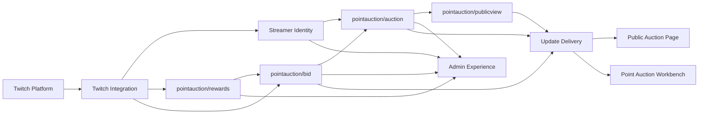

# Strategic Design: Point Auction MVP

This document maps the Point Auction MVP into subdomains and bounded contexts. It is based on PRD [#1](https://github.com/vova-white/chereshniy-bot/issues/1), the current domain glossaries, and the accepted ADRs.

## Subdomain Classification

| Capability | Subdomain type | Why | Initial owner |
| --- | --- | --- | --- |
| Point Auction Rules | Core | This is the product's differentiating behavior: one current Auction List, Auction Lots, Lot Amount, Supporters, Lot Aliases, matching, retroactive matching, active/inactive bidding, and public visibility. | Product/Application |
| Bid Workflow | Core | This is where viewer channel point redemptions become auction outcomes. Twitch-confirmed finalization, idempotency, retry behavior, failed actions, and queue semantics are central to trust. | Product/Application |
| Bid Reward Configuration | Supporting | Required for the Point Auction to work on Twitch, but its value is enabling the core rather than differentiating alone. | Product/Application |
| Twitch Integration | Supporting | OAuth, EventSub, reward synchronization, fulfillment, and refunds are externally constrained by Twitch APIs. The app must adapt to Twitch, not redefine it. | Platform/Application |
| Streamer Identity & Session | Supporting | The app needs Twitch-only sign-in, token custody, and session cookies, but identity is not the product differentiator. | Platform/Application |
| Public Auction View | Supporting | Public viewer access and near-real-time public state are important product surfaces, but they project core auction state rather than define it. | Product/Application |
| Admin Experience | Supporting | Dashboard, Workbench, Rewards Settings, Bid Queue, and mobile-first workflows expose the core model to Streamers. | Product/Application |
| Realtime Delivery | Generic | SSE delivery and connection limits are transport concerns. They should not own auction decisions. | Platform |
| Rate Limiting & HTTP Infrastructure | Generic | Cross-cutting protection and request plumbing. Useful, but not domain-specific. | Platform |

## Bounded Context Catalog

| Context | Responsibility | Owns | Upstream dependencies | Downstream consumers |
| --- | --- | --- | --- | --- |
| pointauction/auction | Owns the current Auction List and the rules for lots, amounts, supporters, aliases, matching, retroactive matching, active/inactive state, and public projection eligibility. | Auction List, Auction Title, Auction Lot, Lot Amount, Lot Alias, Supporter, active/inactive state, normalization rules. | Streamer Identity for channel ownership; pointauction/bid for confirmed bid outcomes. | Admin Experience, pointauction/publicview, pointauction/bid. |
| pointauction/bid | Owns the lifecycle of Incoming Bids and Twitch-confirmed bid actions. Keeps the Bid Queue coherent and enforces idempotency per Twitch redemption. | Incoming Bid, Applying Bid, Applied Bid, Refunding Bid, Refunded Bid, Failed Bid Action, Externally Resolved Bid, Invalid Bid, Bid Queue. | Twitch Integration for redemption status changes; pointauction/auction for target lots and final lot mutations. | Admin Experience, pointauction/auction, Admin Auction Updates. |
| pointauction/rewards | Owns desired Bid Reward Set configuration and synchronization status for managed Twitch rewards and EventSub subscriptions. | Bid Reward Set, Bid Reward Set Title, Bid Reward Description, Bid Reward Option, Reward Color, Failed Reward Sync, EventSub Subscription references. | Twitch Integration for Helix/EventSub operations; pointauction/auction for active/inactive state. | Twitch Integration, Admin Experience, pointauction/bid. |
| Twitch Integration | Anti-corruption layer around Twitch OAuth, Helix channel points APIs, EventSub webhooks, EventSub subscriptions, token refresh, fulfill/refund calls, and webhook signature verification. | Twitch API clients, token refresh mechanics, EventSub message deduplication, external Twitch identifiers. | Twitch platform. | Streamer Identity, pointauction/rewards, pointauction/bid. |
| Streamer Identity | Owns Twitch-only sign-in, Streamer identity, Application Session, Twitch Token Custody, Public Auction Slug lifecycle, and admin access decisions. | Streamer, Twitch Connection, Twitch Token Custody, Application Session, Log Out, Public Auction Slug. | Twitch Integration for identity and token exchange. | Admin Experience, pointauction/auction, pointauction/rewards, pointauction/bid. |
| pointauction/publicview | Owns the unauthenticated Public Auction View and Public Auction Updates payload boundaries. | Public Auction View, Public Auction Updates payloads, public rate/connection limits. | pointauction/auction for current public state. | Viewer-facing Public Auction Page. |
| Admin Experience | Owns browser-facing Streamer workflows and UI language. Does not own domain decisions. | Dashboard, Point Auction Module, Point Auction Summary, Point Auction Workbench, Rewards Settings, Lot Picker, Open/Closed Bidding Status, Empty Auction State. | Streamer Identity, pointauction/auction, pointauction/bid, pointauction/rewards, Admin Auction Updates. | Streamer. |
| Update Delivery | Owns SSE transport for public and admin updates. Does not decide what data is public or admin-only. | SSE connection lifecycle, fanout, connection limits. | pointauction/publicview, pointauction/bid, pointauction/auction. | Public Auction Page, Point Auction Workbench. |

## Context Relationships

## Ubiquitous Language

| Term | Definition | Context |
| --- | --- | --- |
| Streamer | A Twitch broadcaster who signs in to the application and manages their channel's auction. | Streamer Identity |
| Twitch Connection | The Streamer's Twitch-based sign-in and authorization for the auction module. | Streamer Identity |
| Application Session | The browser session that lets a signed-in Streamer access admin workflows. | Streamer Identity |
| Public Auction Slug | The Twitch-login-based public identifier used in the auction page URL. | Streamer Identity |
| Auction List | The single current list of auction lots managed by a Streamer for their channel. | pointauction/auction |
| Auction Title | The Streamer-defined public name of the Auction List. | pointauction/auction |
| Active Auction List | An Auction List whose bid rewards are enabled on Twitch so viewers can place new bids. | pointauction/auction |
| Inactive Auction List | An Auction List whose bid rewards are disabled on Twitch while lots and Incoming Bids remain unchanged. | pointauction/auction |
| Auction Lot | A proposed film, game, or other text item in the Auction List. | pointauction/auction |
| Lot Amount | The integer channel points value currently assigned to an Auction Lot. | pointauction/auction |
| Lot Alias | Alternate lot text that allows future bids to match an existing Auction Lot. | pointauction/auction |
| Supporter | A short name recorded as having supported an Auction Lot. | pointauction/auction |
| Viewer | A Twitch chat participant who can place a bid through a channel points reward but does not sign in to the app. | pointauction/bid |
| Viewer Display Name | The viewer-facing Twitch name recorded on a bid. | pointauction/bid |
| Incoming Bid | A bid received from Twitch that has not yet been applied or rejected by the Streamer. | pointauction/bid |
| Bid Text | The viewer-provided text naming what the bid is meant to support. | pointauction/bid |
| Bid Amount | The integer channel points value of the Twitch reward used to place a bid. | pointauction/bid / pointauction/rewards |
| Applying Bid | A bid chosen for application while the system waits for action completion. | pointauction/bid |
| Applied Bid | A bid that has been applied to an Auction Lot and increased its Lot Amount. | pointauction/bid |
| Refunding Bid | A rejected bid whose channel points return is in progress. | pointauction/bid |
| Refunded Bid | A rejected bid whose channel points were confirmed as returned through Twitch. | pointauction/bid |
| Failed Bid Action | A bid action that did not complete and needs retry or attention. | pointauction/bid |
| Externally Resolved Bid | A bid whose Twitch redemption was already finalized outside the app before the app completed its action. | pointauction/bid |
| Bid Queue | The admin-facing working list of bids that still need attention. | pointauction/bid / Admin Experience |
| Bid Reward Set | A Streamer-defined group of Twitch channel points rewards used for placing bids. | pointauction/rewards |
| Bid Reward Option | One Twitch channel points reward within a Bid Reward Set, with its own Bid Amount and color. | pointauction/rewards |
| Failed Reward Sync | A Bid Reward Set synchronization that did not complete for all managed Twitch rewards/subscriptions. | pointauction/rewards |
| EventSub Subscription | A Twitch event subscription used to receive redemptions for managed Bid Reward Options. | pointauction/rewards / Twitch Integration |
| Public Auction View | The unauthenticated read-only auction data exposed for the Public Auction Page. | pointauction/publicview |
| Public Auction Updates | The unauthenticated near-real-time public updates for the Public Auction Page. | pointauction/publicview / Update Delivery |
| Admin Auction Updates | Authenticated near-real-time updates for the Point Auction Workbench. | Update Delivery |

## Anti-terms

| Avoid | Use instead | Reason |
| --- | --- | --- |
| User | Streamer or Viewer | The Streamer signs in; the Viewer does not. |
| Account | Streamer / Twitch Connection / Application Session | “Account” hides whether we mean Twitch identity, app session, or channel owner. |
| Investor | Supporter | Viewers do not receive ownership or financial rights. |
| Weight | Lot Amount | The value is a channel points total, not a multiplier or ranking weight. |
| Cost / Price | Lot Amount or Bid Amount | The auction does not sell lots; viewers support lots with channel points. |
| Bit | Bid | Twitch Bits are a separate Twitch concept. |
| Redemption | Incoming Bid, Applied Bid, Refunded Bid, etc. | Twitch redemption is an integration detail; bid state is the domain language. |
| Overlay | Public Auction Page | OBS-specific overlay is out of scope for the first release. |
| Disconnect Twitch | Log Out | The first release ends sessions without revoking Twitch authorization. |
| Public user | Viewer | Viewers do not become application users. |
| Reward campaign | Bid Reward Set | The set exists to configure bid rewards for Point Auction. |

## Boundary Decisions

| Decision | Rationale |
| --- | --- |
| Keep pointauction/auction and pointauction/bid close, but name them as separate contexts. | Auction matching and lot mutation are core domain rules; bid workflows have independent Twitch-confirmed lifecycle complexity. They should have clear interfaces even if implemented in one deployable at first. |
| Keep lot matching inside pointauction/auction. | Matching answers which Auction Lot belongs to a Bid Text using current lot names and aliases; pointauction/bid may request matching but does not own normalization, alias uniqueness, or retroactive matching rules. |
| Apply bid outcomes through pointauction/auction. | pointauction/bid owns the Twitch-confirmed bid lifecycle, but it must change Lot Amounts, Supporters, and aliases through Point Auction application interfaces rather than writing lot state directly. |
| Treat Twitch Integration as an anti-corruption layer. | Twitch has its own language: rewards, redemptions, EventSub messages, Helix API errors, access tokens. Core contexts should speak in Auction Lots, Incoming Bids, Bid Reward Options, and confirmed outcomes instead. |
| Keep Streamer Identity separate from pointauction/auction. | Login/session/token custody has different security and lifecycle concerns than auction rules, and future modules will reuse Twitch-only Streamer identity. |
| Keep pointauction/publicview separate from Admin Experience. | Public viewers see a strict read-only subset. Admin workflows can see Bid Queue, failed actions, aliases, reward state, and command feedback. |
| Build Public Auction View on demand in the MVP. | Public state is a filtered view of the current Auction List and lots. A separate persisted projection would add synchronization failure modes before there is a proven load or lifecycle need. |
| Build Admin Workbench views on demand in the MVP. | A Streamer manages one current Auction List, so summary/workbench queries can compose auction, bid, and rewards state directly. Separate admin projections would add synchronization failure modes before query cost requires them. |
| Keep Update Delivery generic. | SSE is transport. It must not own public/private payload decisions or bid workflow state transitions. |
| Keep pointauction/rewards separate from pointauction/bid. | Reward configuration defines the managed Twitch rewards and subscriptions; pointauction/bid handles redemptions after they arrive. Changes in rewards should not rewrite already captured Bid Amounts. |
| Do not create separate Viewer Identity context. | Viewers do not sign in and only Viewer Display Name is stored. A stable viewer identity would be premature and contradict the MVP privacy boundary. |
| Do not create Auction Session / Archive context. | The MVP has one current Auction List and no rounds or archives. Introducing a history context would add lifecycle concepts the domain has not chosen. |

## Deep Module Candidates

| Module | Stable interface | Encapsulates |
| --- | --- | --- |
| Lot Matching | Given Auction List names/aliases and Bid Text, return zero or one match plus conflicts. | Normalization, uniqueness, aliases, retroactive matching triggers. |
| Bid Workflow Engine | Accept bid commands/events and emit state transitions plus Twitch operation requests. | Applying/refunding states, idempotency, retry, externally resolved outcomes, returned pending behavior. |
| Reward Sync Engine | Accept desired Bid Reward Set and current Twitch-managed state, produce sync operations and sync result. | Create/update/disable rewards, EventSub subscriptions, active/inactive behavior, Failed Reward Sync. |
| Twitch Anti-corruption Client | Domain-facing methods for identity, rewards, redemptions, EventSub subscriptions, and token refresh. | Helix/EventSub request details, error mapping, token refresh, Twitch identifiers. |
| Public Projection Builder | Given current Auction List and status, return Public Auction View. | Public field filtering, sorting, title fallback, open/closed status, empty state data. |
| Admin Projection Builder | Given auction, bid queue, rewards, and sync states, return Workbench/Dashboard models. | Admin-only field selection, pending/failed queue state, summary counts. |
| Update Publisher | Publish public/admin update events to SSE channels. | Fanout, connection limits, session/slug routing, public/admin separation. |
